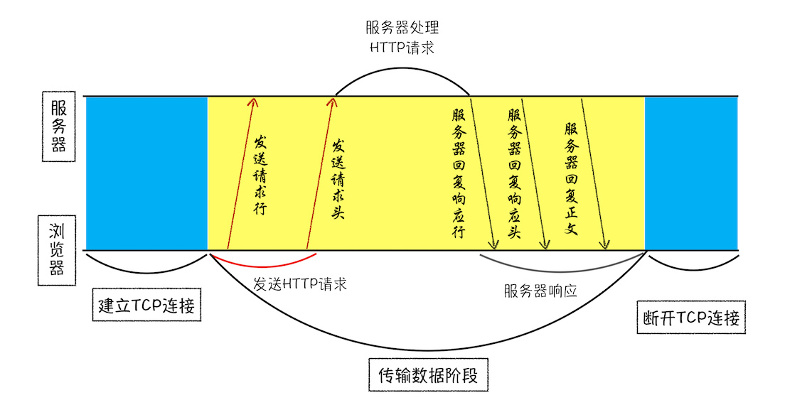

# 浏览器工作原理及实践

## 宏观视角下的浏览器

### HTTP请求流程：为什么很多站点第二次打开速度会很快？

- 浏览器使用 HTTP 协议作为应用层协议，用来封装请求的文本信息；并使用 TCP/IP 作传输层协议将它发到网络上，所以在 HTTP 工作开始之前，浏览器需要通过 TCP 与服务器建立连接。也就是说 HTTP 的内容是通过 TCP 的传输数据阶段来实现的，你可以结合下图更好地理解这二者的关系。

  > 网络七层协议   
  从下往上依次为物理层、数据链路层、网络层、传输层、会话层、表示层和应用层

### 渲染流程：HTML、CSS 和 JavaScript，是如何变成页面的？

- 按照渲染的时间顺序，流水线可分为如下几个子阶段：构建 DOM 树、样式计算、布局阶段、分层、绘制、分块、光栅化和合成。

#### 构建 DOM 树

- 为什么要构建 DOM 树呢？这是因为浏览器无法直接理解和使用 HTML，所以需要将 HTML 转换为浏览器能够理解的结构 —— DOM 树。


#### 样式计算

- 和 HTML 文件一样，浏览器也是无法直接理解这些纯文本的 CSS 样式，所以当渲染引擎接收到 CSS 文本时，会执行一个转换操作，将 CSS 文本转换为浏览器可以理解的结构 —— styleSheets。只需要在控制台中输入 document.styleSheets，然后就看到如下图所示的结构：


- 现在我们已经把现有的 CSS 文本转化为浏览器可以理解的结构了，那么接下来就要对其进行属性值的标准化操作。  
要理解什么是属性值标准化，你可以看下面这样一段 CSS 文本：  
  ```css
  body { font-size: 2em }
  p {color:blue;}
  span  {display: none}
  div {font-weight: bold}
  div  p {color:green;}
  div {color:red; }
  ```
  可以看到上面的 CSS 文本中有很多属性值，如 2em、blue、bold，这些类型数值不容易被渲染引擎理解，所以需要将所有值转换为渲染引擎容易理解的、标准化的计算值，这个过程就是属性值标准化。  
  那标准化后的属性值是什么样子的？
  

- 计算出 DOM 树中每个节点的具体样式，这里就涉及到 CSS 的继承规则和层叠规则了。CSS 继承就是每个 DOM 节点都包含有父节点的样式。样式计算过程中的第二个规则是样式层叠。层叠是 CSS 的一个基本特征，它是一个定义了如何合并来自多个源的属性值的算法。它在 CSS 处于核心地位，CSS 的全称“层叠样式表”正是强调了这一点。

#### 布局阶段

- 现在，我们有 DOM 树和 DOM 树中元素的样式，但这还不足以显示页面，因为我们还不知道 DOM 元素的几何位置信息。那么接下来就需要计算出 DOM 树中可见元素的几何位置，我们把这个计算过程叫做布局。
  > 布局阶段主要完全两个任务：创建布局树和布局计算。  
  DOM 树中还含有很多不可见的元素，比如 `head` 标签，还有使用了 `display: none` 属性的元素。所以在显示之前，我们还要额外地创建一棵只包含可见元素布局树。  
  有了一棵完整的布局树。那么接下来，就要计算布局树节点的坐标位置了。在执行布局操作的时候，会把布局运算的结果重新写回布局树中，所以布局树既是输入内容也是输出内容，这是布局阶段一个不合理的地方，因为在布局阶段并没有清晰地将输入内容和输出内容区分开来。针对这个问题，Chrome 团队正在重构布局代码，下一代布局系统叫 LayoutNG，试图更清晰地分离输入和输出，从而让新设计的布局算法更加简单。

#### 分层

- 现在我们有了布局树，而且每个元素的具体位置信息都计算出来了，那么接下来是不是就要开始着手绘制页面了？答案依然是否定的。因为页面中有很多复杂的效果，如一些复杂的 3D 变换、页面滚动，或者使用 z-indexing 做 z 轴排序等，为了更加方便地实现这些效果，渲染引擎还需要为特定的节点生成专用的图层，并生成一棵对应的图层树（LayerTree）。

通常情况下，并不是布局树的每个节点都包含一个图层，如果一个节点没有对应的层，那么这个节点就从属于父节点的图层。
  > 需要满足下列条件，渲染引擎才会为特定的节点创建新的层。
  > - 第一点，拥有层叠上下文属性的元素会被提升为单独的一层。[层叠上下文参考文章](https://developer.mozilla.org/zh-CN/docs/Web/Guide/CSS/Understanding_z_index/The_stacking_context)
  > - 第二点，需要剪裁（clip）的地方也会被创建为图层。（这里指的是比如有一段超过容器的文字，浏览器会出现滚动条，则浏览器会把文字内容单独创建一层，然后把这一层的部分显示在容器中，但是我在 Chrome79 上没有验证成功）

#### 图层绘制

- 渲染引擎会把一个图层的绘制拆分成很多小的绘制指令，然后再把这些指令按照顺序组成一个待绘制列表

#### 栅格化操作

- 绘制列表只是用来记录绘制顺序和绘制指令的列表，而实际上绘制操作是由渲染引擎中的合成线程来完成的。  
通常一个页面可能很大，但是用户只能看到其中的一部分，我们把用户可以看到的这个部分叫做视口（viewport）。  
在有些情况下，有的图层可以很大，比如有的页面你使用滚动条要滚动好久才能滚动到底部，但是通过视口，用户只能看到页面的很小一部分，所以在这种情况下，要绘制出所有图层内容的话，就会产生太大的开销，而且也没有必要。  
基于这个原因，合成线程会将图层划分为图块（tile），这些图块的大小通常是 256x256 或者 512x512。
合成线程会按照视口附近的图块来优先生成位图，实际生成位图的操作是由栅格化来执行的。所谓栅格化，是指将图块转换为位图。

#### 合成和显示

- 一旦所有图块都被光栅化，合成线程就会生成一个绘制图块的命令——“DrawQuad”，然后将该命令提交给浏览器进程。  
浏览器进程里面有一个叫 viz 的组件，用来接收合成线程发过来的 DrawQuad 命令，然后根据 DrawQuad 命令，将其页面内容绘制到内存中，最后再将内存显示在屏幕上。

#### 总结

一个完整的渲染流程大致可总结如下：

- 渲染进程将 HTML 内容转换为能够读懂的 DOM 树结构。
- 渲染引擎将 CSS 样式表转化为浏览器可以理解的 styleSheets，计算出 DOM 节点的样式。
- 创建布局树，并计算元素的布局信息。
- 对布局树进行分层，并生成分层树。
- 为每个图层生成绘制列表，并将其提交到合成线程。
- 合成线程将图层分成图块，并在光栅化线程池中将图块转换成位图。
- 合成线程发送绘制图块命令 DrawQuad 给浏览器进程。
- 浏览器进程根据 DrawQuad 消息生成页面，并显示到显示器上。

#### 相关概念

- 有了上面介绍渲染流水线的基础，我们再来看看三个和渲染流水线相关的概念——“重排”“重绘”和“合成”。
  > - 更新了元素的几何属性（重排），如果你通过 JavaScript 或者 CSS 修改元素的几何位置属性，例如改变元素的宽度、高度等，那么浏览器会触发重新布局，解析之后的一系列子阶段，这个过程就叫重排。无疑，重排需要更新完整的渲染流水线，所以开销也是最大的。
  > - 更新元素的绘制属性（重绘），如果修改了元素的背景颜色，那么布局阶段将不会被执行，因为并没有引起几何位置的变换，所以就直接进入了绘制阶段，然后执行之后的一系列子阶段，这个过程就叫重绘。相较于重排操作，重绘省去了布局和分层阶段，所以执行效率会比重排操作要高一些。
  > - 直接合成阶段，如果你更改一个既不要布局也不要绘制的属性，渲染引擎将跳过布局和绘制，只执行后续的合成操作，我们把这个过程叫做合成。

## 浏览器中的 JavaScript 执行机制

### 变量提升：JavaScript 代码是按顺序执行的吗？

- JavaScript 代码执行过程中，需要先做变量提升，而之所以需要实现变量提升，是因为 JavaScript 代码在执行之前需要先编译。

- 在编译阶段，变量和函数会被存放到变量环境中，变量的默认值会被设置为 undefined；在代码执行阶段，JavaScript 引擎会从变量环境中去查找自定义的变量和函数。

- 如果在编译阶段，存在两个相同的函数，那么最终存放在变量环境中的是最后定义的那个，这是因为后定义的会覆盖掉之前定义的。
  > 如果变量和函数同名，那么在编译阶段，变量的声明会被忽略。

### 调用栈：为什么 JavaScript 代码会出现栈溢出
